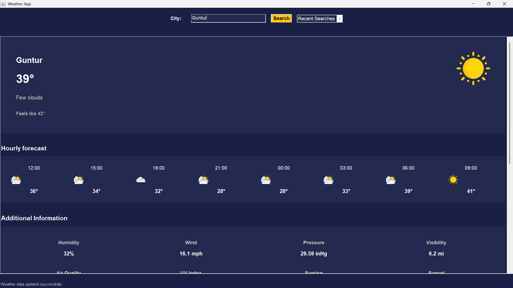

# Weather App

A Java-based desktop weather application that provides current weather conditions, hourly forecasts, and 10-day forecasts for cities worldwide.



## Features

- **Current Weather Display**: Temperature, weather description, and "feels like" temperature
- **Hourly Forecast**: 8-hour forecast with temperature and weather conditions
- **10-Day Forecast**: Extended forecast showing daily high and low temperatures
- **Additional Weather Information**: Humidity, wind speed, pressure, visibility, and air quality
- **Search History**: Recent searches are saved and easily accessible
- **Modern UI**: Clean, intuitive interface with weather icons and color-coded information

## Technologies Used

- Java AWT/Swing for the user interface
- OpenWeatherMap API for weather data
- SQLite for local data storage
- JSON parsing for API responses

## Getting Started

### Prerequisites

- Java Development Kit (JDK) 8 or higher
- Maven (for dependency management)
- Internet connection (for API access)

### Installation

1. Clone the repository:
   ```bash
   git clone https://github.com/yourusername/weather-app.git
   cd weather-app

2. Build the project with Maven:
   ```bash
   mvn clean install

3. Run the application:
   ```bash
   java -cp "target/classes;lib/sqlite-jdbc-3.42.0.0.jar;lib/json-20230618.jar" WeatherApp

### Configuration
1. Create a free account at OpenWeatherMap to get an API key
2. Add your API key to src/main/resources/config.properties :
   ```bash
   api.key=YOUR_API_KEY_HERE

### Usage
1. Enter a city name in the search field
2. Click the "Search" button or press Enter
3. View current weather conditions, hourly forecast, and 10-day forecast
4. Access recent searches from the dropdown menu

### Project Structure
  ```bash
  weather-app/
  ├── src/
  │   ├── main/
  │   │   ├── java/
  │   │   │   ├── controller/
  │   │   │   │   └── WeatherAPIService.java
  │   │   │   ├── model/
  │   │   │   │   ├── DatabaseHandler.java
  │   │   │   │   └── WeatherData.java
  │   │   │   └── view/
  │   │   │       └── WeatherAppUI.java
  │   │   └── resources/
  │   │       ├── config.properties
  │   │       └── icons/
  │   │           ├── clear.png
  │   │           ├── clouds.png
  │   │           ├── rain.png
  │   │           └── ...
  │   └── test/
  │       └── java/
  │           └── ...
  └── pom.xml
  ```
### Acknowledgments
- Weather data provided by OpenWeatherMap
- Weather icons designed by Freepik
- Inspired by modern weather applications like AccuWeather and Weather.com
